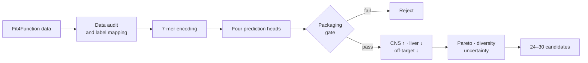

<div align="center">
  <h1>LIFS-Comp_AAV9</h1>
  <p><strong>Tissue-specific AAV9 capsid design for spinal muscular atrophy</strong></p>
  <p>CNS enrichment proxy · Lower liver burden proxy · Packaging-aware virtual screening</p>
  <p>
    <a href="README.md"><strong>English</strong></a>
    ·
    <a href="README.zh-CN.md">简体中文</a>
    ·
    <a href="docs/PROJECT_SPEC.md">Project specification</a>
    ·
    <a href="docs/FIT4FUNCTION_AUDIT.md">Fit4Function audit</a>
  </p>
  <p>
    
    
    
    
  </p>
</div>

<p align="center">
  
</p>

## Overview

`LIFS-Comp_AAV9` is a four-person, four-week computational research project for
the LIFS Competition. It explores AAV9 capsid variants carrying a constrained
7-amino-acid insertion near the intended surface site and asks one focused
question:

> Can we retain predicted capsid packaging fitness while shifting the available
> mouse-organ proxy profile toward brain/spinal cord and away from liver and
> other off-target organs?

The motivating application is future **SMN1 delivery for spinal muscular
atrophy (SMA)**. The project engineers the delivery vehicle, not the SMN1 cargo.

## Why this direction?

Existing systemic AAV9 therapy establishes a real SMA application context, but
the computational opportunity here is more specific: use multi-organ labels to
search for capsids with a more favorable predicted distribution profile.

| Objective | Role in screening | Current proxy |
| --- | --- | --- |
| `F_pack` | **Hard gate** | Packaging/production label |
| `F_CNS` | Reward | Mean of mouse brain and spinal-cord predictions |
| `F_liv` | Primary penalty | Mouse liver prediction |
| `F_off` | Secondary penalty | Mean of mouse heart and kidney predictions |
| `R_imm` | Annotation only | Antibody-footprint or immune-risk proximity |

Human liver-cell predictions are retained as a secondary warning, not counted
twice as another large objective.

## Screening loop



Models predict individual endpoints. The presentation score is calculated
after training and is not inserted into the training loss:

```text
S  = 0.45 × F_CNS − 0.35 × F_liv − 0.20 × F_off
SI = F_CNS / (F_liv + ε)
```

The weights are working assumptions. Candidate stability will be tested under
weight perturbations, and the scientific result will retain three Pareto groups:
**CNS-favoring**, **liver-minimizing**, and **balanced**.

## Technical approach

| Layer | Initial implementation | Later comparison |
| --- | --- | --- |
| Data | pandas, canonical schema, missing-label audit | Batch and replicate-aware mapping |
| Sequence | 7-mer one-hot encoding | Physicochemical or pretrained embeddings |
| Models | Ridge and Random Forest per endpoint | LightGBM or shared PyTorch encoder |
| Validation | Sequence-aware split, held-out metrics | Uncertainty and primate blind test |
| Screening | Packaging gate, score, SI, Pareto | Diversity, distance and structural checks |

Simple baselines come first. A neural model is justified only if it improves
held-out performance without sequence leakage.

## Repository layout

```text
LIFS-Comp_AAV9/
├── configs/default.yaml        # Targets, weights and validation policy
├── data/                       # Local data stages; contents ignored by Git
├── docs/
│   ├── PROJECT_SPEC.md         # Scientific question and claim boundaries
│   ├── DATA_CONTRACT.md        # Canonical labels and audit questions
│   └── TEAM_WORKFLOW.md        # Four-person ownership and Git workflow
├── notebooks/                  # Exploratory work only
├── src/aav9_sma/
│   ├── data/audit.py           # Schema and coverage audit
│   ├── features/encode.py      # Deterministic 7-mer encoding
│   ├── models/baseline.py      # Ridge/Random Forest baselines
│   └── screening/              # Packaging gate, score and Pareto analysis
├── tests/                      # Unit tests
└── pyproject.toml              # Python dependencies and tooling
```

## Quick start

```bash
git clone https://github.com/stephenovo/LIFS-Comp_AAV9.git
cd LIFS-Comp_AAV9

python3 -m venv .venv
source .venv/bin/activate
python -m pip install --upgrade pip
python -m pip install ".[dev]"

ruff check .
pytest
```

Optional model dependencies:

```bash
python -m pip install ".[dev,models]"
```

## Command-line scaffold

Audit a dataset after its source columns have been mapped to the canonical
schema:

```bash
aav9-sma audit-data data/processed/fit4function.csv \
  --output artifacts/data_audit.json
```

Rank model predictions after choosing a packaging threshold from training and
validation evidence:

```bash
aav9-sma rank-candidates artifacts/predictions.csv \
  --packaging-threshold 0.50 \
  --output artifacts/ranked_candidates.csv
```

`0.50` is an interface example, not a biological threshold.

## Current status

- [x] Research question and claim boundaries
- [x] Python package and continuous integration
- [x] Canonical data contract
- [x] Data-audit, encoding and baseline-model scaffold
- [x] Packaging gate, display score and Pareto utilities
- [x] Fit4Function processed-data, Zenodo, and SRA audit
- [x] Exact-anchor and paper-parameter Bowtie2 FASTQ pilots
- [x] Reproducible ENA manifest, resumable downloader, and MD5 checks
- [x] Liver + virus-reference reconstruction validated against the public label (`r = 0.978`)
- [x] 60 organ runs + 3 validated prod2 reference runs reconstructed into sequence-linked labels
- [x] Distance-separated sequence holdout with animal 4 as an untouched biological test
- [x] Shared multi-task MLP comparison on the untouched Animal 4 test
- [ ] Candidate generation and final shortlist

### Reconstructed-data checkpoint

The current table links 100,000 7-mers to animal-level brain, spinal-cord,
liver, heart, and kidney enrichments. It was reconstructed from 385,983,540
aligned records across 63 runs; 96,169,266 reads mapped to the public 100K
sequence set. The final benchmark trains on animals 1–3, removes one-mutation
neighbors of test sequences from training, and evaluates only against animal 4.

| Endpoint | Finite 4-animal labels | Animals 1–3 vs animal 4 `r` | Ridge vs animal 4 `r` | Random Forest vs animal 4 `r` |
| --- | ---: | ---: | ---: | ---: |
| Brain | 96,621 | 0.621 | 0.429 | **0.445** |
| Spinal cord | 97,397 | 0.640 | 0.446 | **0.476** |
| Liver | 97,874 | 0.823 | 0.680 | **0.715** |
| Heart | 98,309 | 0.598 | 0.330 | **0.359** |
| Kidney | 98,332 | 0.730 | **0.561** | 0.539 |

### Multi-task checkpoint

A shared `64→32` MLP was trained once on the 73,553 distance-filtered rows
with complete five-organ labels. Its hidden layers are shared across brain,
spinal cord, liver, heart, and kidney; targets are standardized from training
data only. It stopped after 31 iterations and improved Pearson correlation on
the untouched Animal 4 test for every endpoint:

| Endpoint | Best single-task baseline `r` | Shared MLP `r` | Change |
| --- | ---: | ---: | ---: |
| Brain | 0.445 | **0.527** | +0.082 |
| Spinal cord | 0.476 | **0.546** | +0.070 |
| Liver | 0.715 | **0.778** | +0.063 |
| Heart | 0.359 | **0.439** | +0.080 |
| Kidney | 0.561 | **0.622** | +0.061 |

This passes the multi-task comparison gate, but does not yet pass the
screening gate. Candidate generation, calibrated packaging uncertainty,
weight sensitivity, and diversity selection remain separate work.

Machine-readable results: [replicate QC](docs/audit_data/fit4function_multiorgan_replicate_metrics.csv),
[run QC](docs/audit_data/fit4function_multiorgan_run_qc.csv), and
[strict baselines](docs/audit_data/fit4function_multiorgan_baseline_metrics.csv), and
[multi-task results](docs/audit_data/fit4function_multitask_metrics.csv).

## Scientific boundary

This repository contains **computational hypotheses**, not a validated therapy.

- Mouse brain/spinal-cord enrichment is a CNS proxy, not demonstrated human
  motor-neuron specificity.
- Reduced predicted liver enrichment is not demonstrated reduction of liver
  toxicity.
- Packaging and tropism predictions require experimental validation.
- The project does not claim to replace or outperform Zolgensma.

## Selected references

- [Fit4Function: data-driven AAV capsid engineering](https://pmc.ncbi.nlm.nih.gov/articles/PMC11297966/)
- [Engineering adeno-associated virus vectors for gene therapy](https://www.nature.com/articles/s41576-019-0205-4)
- [FDA Zolgensma prescribing information](https://www.fda.gov/media/126109/download)

---

<div align="center">
  <strong>Package first. Shift the proxy profile. Keep every claim testable.</strong>
</div>
