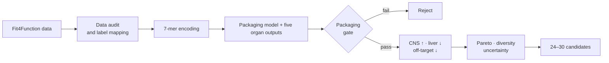

<div align="center">
  <h1>LIFS-Comp_AAV9</h1>
  <p><strong>Tissue-specific AAV9 capsid design for spinal muscular atrophy</strong></p>
  <p>CNS enrichment proxy · Lower liver burden proxy · Packaging-aware virtual screening</p>
  <p>
    <a href="README.md"><strong>English</strong></a>
    ·
    <a href="README.zh-CN.md">简体中文</a>
    ·
    <a href="docs/PROJECT_SPEC.md">Project specification</a>
    ·
    <a href="docs/FIT4FUNCTION_AUDIT.md">Fit4Function audit</a>
    ·
    <a href="docs/THREE_ROUTE_CONSENSUS.md">Three-route comparison</a>
    ·
    <a href="docs/EXPERIMENTAL_VALIDATION_SOP.md">Experimental validation SOP</a>
  </p>
  <p>
    
    
    
    
  </p>
</div>

<p align="center">
  
</p>

## Overview

`LIFS-Comp_AAV9` is a four-person, four-week computational research project for
the LIFS Competition. It explores AAV9 capsid variants carrying a constrained
7-amino-acid insertion near the intended surface site and asks one focused
question:

> Can we retain predicted capsid packaging fitness while shifting the available
> mouse-organ proxy profile toward brain/spinal cord and away from liver and
> other off-target organs?

The motivating application is future **SMN1 delivery for spinal muscular
atrophy (SMA)**. The project engineers the delivery vehicle, not the SMN1 cargo.

## Why this direction?

Existing systemic AAV9 therapy establishes a real SMA application context, but
the computational opportunity here is more specific: use multi-organ labels to
search for capsids with a more favorable predicted distribution profile.

| Objective | Role in screening | Current proxy |
| --- | --- | --- |
| `F_pack` | **Hard gate** | Packaging/production label |
| `F_CNS` | Default reward | Mean of mouse brain and spinal-cord predictions |
| `F_SMA` | Optional sensitivity route | Configurable brain/spinal weighting, e.g. `0.30/0.70` |
| `F_liv` | Primary penalty | Mouse liver prediction |
| `F_off` | Secondary penalty | Mean of mouse heart and kidney predictions |
| `R_imm` | Annotation only | Antibody-footprint or immune-risk proximity |

Human liver-cell predictions are retained as a secondary warning, not counted
twice as another large objective.

## Screening loop



Models predict individual endpoints. The presentation score is calculated
after training and is not inserted into the training loss:

```text
F_target(default) = 0.50 × F_brain + 0.50 × F_spinal
F_target(optional SMA sensitivity) = 0.30 × F_brain + 0.70 × F_spinal
S        = 0.45 × F_target − 0.35 × F_liv − 0.20 × F_off
log2(SI) = F_target − F_liv
SI       = 2^(F_target − F_liv)
```

The weights are working assumptions. The previously evaluated baseline remains 50/50;
non-equal brain/spinal weights must be selected explicitly. Candidate stability
is tested across 27 objective-weight combinations. The joint shortlist contains **spinal-favoring**,
**liver-minimizing**, and **balanced** groups, while strict Pareto membership is
reported separately rather than forced for every row. A configurable sequential
route filters spinal cord, brain, liver, heart, and kidney in that order on the
same predictions. It is a comparison-only sensitivity analysis, not a promoted
replacement for the joint shortlist. See
[SMA parallel screening strategies](docs/SMA_PARALLEL_SCREENING.md).

## Technical approach

| Layer | Initial implementation | Later comparison |
| --- | --- | --- |
| Data | pandas, canonical schema, missing-label audit | Batch and replicate-aware mapping |
| Sequence | 7-mer one-hot encoding | Physicochemical or pretrained embeddings |
| Models | Ridge and Random Forest per endpoint | Shared `64→32` MLP ensemble |
| Validation | Distance-2 sequence split and Animal 4 holdout | Primate blind test if available |
| Screening | Calibrated packaging lower bound and Pareto | Weight stability, distance and diversity |

Simple baselines come first. A neural model is justified only if it improves
held-out performance without sequence leakage.

## Repository layout

```text
LIFS-Comp_AAV9/
├── configs/default.yaml        # Targets, weights and validation policy
├── data/                       # Local data stages; contents ignored by Git
├── docs/
│   ├── PROJECT_SPEC.md         # Scientific question and claim boundaries
│   ├── DATA_CONTRACT.md        # Canonical labels and audit questions
│   └── TEAM_WORKFLOW.md        # Four-person ownership and Git workflow
├── notebooks/                  # Exploratory work only
├── src/aav9_sma/
│   ├── data/audit.py           # Schema and coverage audit
│   ├── features/encode.py      # Deterministic 7-mer encoding
│   ├── models/baseline.py      # Ridge/Random Forest baselines
│   └── screening/              # Packaging gate, score and Pareto analysis
├── tests/                      # Unit tests
└── pyproject.toml              # Python dependencies and tooling
```

## Quick start

```bash
git clone https://github.com/stephenovo/LIFS-Comp_AAV9.git
cd LIFS-Comp_AAV9

python3 -m venv .venv
source .venv/bin/activate
python -m pip install --upgrade pip
python -m pip install ".[dev]"
```

## Run the self-contained smoke test first

The following command needs no Fit4Function checkout, SRA download, SRA Toolkit,
or GPU. It completes the audit, prediction-table, packaging-gate, and ranking
path on deterministic synthetic data:

```bash
aav9-sma demo --output-dir artifacts/demo
```

The outputs are installation checks only and must not be used for biological
claims. See [the reproducibility guide](docs/REPRODUCIBILITY.md).

```bash
ruff check .
pytest
```

Optional model dependencies:

```bash
python -m pip install ".[dev,models]"
```

## Command-line scaffold

Audit a dataset after its source columns have been mapped to the canonical
schema:

```bash
aav9-sma audit-data data/processed/fit4function.csv \
  --output artifacts/data_audit.json
```

Rank model predictions after choosing a packaging threshold from training and
validation evidence:

```bash
aav9-sma rank-candidates artifacts/predictions.csv \
  --packaging-threshold 0.50 \
  --output artifacts/ranked_candidates.csv
```

`0.50` is an interface example, not a biological threshold.

The full one-million-sequence virtual screen is a separate data-dependent run.
It requires the external Fit4Function checkout and the reconstructed multi-organ
CSV described in [FIT4FUNCTION_RUNBOOK.md](docs/FIT4FUNCTION_RUNBOOK.md):

```bash
aav9-sma screen-virtual \
  data/raw/fit4function_official/data/fit4function_library_screens.csv \
  data/processed/fit4function_multiorgan_reconstructed.csv.gz \
  --pool-size 1000000 --ensemble-size 5 \
  --output-ranked artifacts/virtual_screen_ranked.csv.gz \
  --output-pareto docs/audit_data/virtual_screen_pareto.csv \
  --output-shortlist docs/audit_data/virtual_screen_shortlist.csv \
  --output-summary docs/audit_data/virtual_screen_summary.json
```

## Current status

- [x] Research question and claim boundaries
- [x] Python package and continuous integration
- [x] Canonical data contract
- [x] Data-audit, encoding and baseline-model scaffold
- [x] Packaging gate, display score and Pareto utilities
- [x] Fit4Function processed-data, Zenodo, and SRA audit
- [x] Exact-anchor and paper-parameter Bowtie2 FASTQ pilots
- [x] Reproducible ENA manifest, resumable downloader, and MD5 checks
- [x] Liver + virus-reference reconstruction validated against the public label (`r = 0.978`)
- [x] 60 organ runs + 3 validated prod2 reference runs reconstructed into sequence-linked labels
- [x] Distance-separated sequence holdout with Animal 4 as a biological test
- [x] Shared multi-task MLP comparison on the held-out Animal 4 test
- [x] Masked-loss PyTorch and LightGBM/physicochemical challengers
- [x] Bootstrap confidence intervals and an explicit model-promotion gate
- [x] Empirical positive/negative control audit through the funnel
- [x] One-million-sequence virtual screen and 30-candidate computational shortlist
- [x] Strict conservative subset and site-level NAb context annotation
- [x] Bilingual experimental-validation SOP, preregistration, candidate panel, and data-entry workbook

### Reconstructed-data checkpoint

The current table links 100,000 7-mers to animal-level brain, spinal-cord,
liver, heart, and kidney enrichments. It was reconstructed from 385,983,540
aligned records across 63 runs; 96,169,266 reads mapped to the public 100K
sequence set. The final benchmark trains on animals 1–3, removes one-mutation
neighbors of test sequences from training, and evaluates only against animal 4.
The public release contains no Animal 5. A retrospective
[leave-one-animal-out audit](docs/CROSS_ANIMAL_ROBUSTNESS_AUDIT.zh-CN.md) now rotates Animals 1–4:
brain Pearson averages 0.445 (range 0.358–0.554) and spinal-cord Pearson averages
0.489 (range 0.396–0.571). Animal 4 is at the optimistic end, so this is labeled
development robustness evidence rather than a new blind animal.

| Endpoint | Finite 4-animal labels | Animals 1–3 vs animal 4 `r` | Ridge vs animal 4 `r` | Random Forest vs animal 4 `r` |
| --- | ---: | ---: | ---: | ---: |
| Brain | 96,621 | 0.621 | 0.429 | **0.445** |
| Spinal cord | 97,397 | 0.640 | 0.446 | **0.476** |
| Liver | 97,874 | 0.823 | 0.680 | **0.715** |
| Heart | 98,309 | 0.598 | 0.330 | **0.359** |
| Kidney | 98,332 | 0.730 | **0.561** | 0.539 |

### Multi-task checkpoint

A shared `64→32` MLP was trained once on the 73,553 distance-filtered rows
with complete five-organ labels. Its hidden layers are shared across brain,
spinal cord, liver, heart, and kidney; targets are standardized from training
data only. It stopped after 31 iterations and improved Pearson correlation on
the held-out Animal 4 test for every endpoint:

| Endpoint | Best single-task `r` | Five-model ensemble `r` | Masked PyTorch `r` | LightGBM + physchem `r` |
| --- | ---: | ---: | ---: | ---: |
| Brain | 0.445 | **0.554** | 0.547 | 0.522 |
| Spinal cord | 0.476 | **0.571** | 0.562 | 0.538 |
| Liver | 0.715 | **0.785** | 0.781 | 0.774 |
| Heart | 0.359 | **0.458** | 0.453 | 0.408 |
| Kidney | 0.561 | **0.635** | 0.628 | 0.613 |

The masked model used more partially observed rows, but neither challenger
improved the held-out mean. The five-model ensemble therefore remains the
virtual-screen predictor. See the [three-route consensus report](docs/THREE_ROUTE_CONSENSUS.md)
for bootstrap intervals and the promotion decision.

### Virtual-screen checkpoint

The deterministic screen sampled 1,000,000 legal, unique 7-mers outside the
observed 100K library. A distance-2 calibration split set the one-sided 95%
packaging lower-bound offset. Of the generated pool, 6,016 passed the hard
packaging gate and 169 were strictly Pareto-optimal. The final 30 rows contain
10 candidates per presentation group, all at training-distance lower bound
`≥2`, with pairwise Hamming distance `≥3`, and all within the top 5% of eligible
candidates under the default display score. Six of the 30 are on the strict
Pareto front; the other 24 are explicitly marked high-scoring, diverse
near-front hypotheses. Eight pool members also meet the strict conservative
definition (packaging, spinal-cord median, low-liver median, and low model
disagreement), and seven of those are present in the final 30.


Machine-readable results: [replicate QC](docs/audit_data/fit4function_multiorgan_replicate_metrics.csv),
[run QC](docs/audit_data/fit4function_multiorgan_run_qc.csv), and
[strict baselines](docs/audit_data/fit4function_multiorgan_baseline_metrics.csv), and
[single multi-task results](docs/audit_data/fit4function_multitask_metrics.csv),
[ensemble results](docs/audit_data/fit4function_multitask_ensemble_metrics.csv),
[Pareto table](docs/audit_data/virtual_screen_pareto.csv), and
[30-candidate shortlist](docs/audit_data/virtual_screen_shortlist.csv). The
[three-route comparison](docs/THREE_ROUTE_CONSENSUS.md) records challenger
results, control behavior, adopted consensus, and route-specific differences.
The separate [12-sequence composition challenge](docs/audit_data/composition_challenge_panel.csv)
covers `C/F/I/M/W/Y` with one strict-95 packaging survivor and one 90%-only
near miss per residue. It is a packaging/QC stress test, not an extension of
the therapeutic shortlist. The [final blind-test protocol](docs/FINAL_BLIND_TEST_PROTOCOL.zh-CN.md)
defines the new-data design, role separation, immutable freeze, one-time
unblinding, and automatic downgrade if the blind is broken.

### Experimental-validation handoff

The computational shortlist is now connected to a pre-registered experimental
decision path. The [English SOP](docs/EXPERIMENTAL_VALIDATION_SOP.md) and
[Chinese SOP](docs/EXPERIMENTAL_VALIDATION_SOP.zh-CN.md) specify matched
controls, blinding, independent production batches, packaging QC, motor-neuron
and liver-cell assays, systemic mouse biodistribution, SMA follow-up, neutralizing-
antibody testing, statistics, and explicit go/hold/stop rules. Laboratory
procedures must be carried out by a qualified AAV core under its validated SOPs
and institutional approvals.

The handoff package includes the
[37-item candidate/control panel](docs/audit_data/experimental_validation_panel.csv),
[source-checksum manifest](docs/audit_data/experimental_validation_manifest.json),
[long-format result schema](docs/audit_data/wet_lab_results_template.csv),
[decision log](docs/audit_data/wet_lab_decision_log.csv),
[preregistration template](docs/WET_LAB_PREREGISTRATION_TEMPLATE.md), and a
[formatted Excel workbook](docs/audit_data/experimental_validation_handoff.xlsx).
The machine-readable panel, manifest, and empty templates can be regenerated with:

```bash
PYTHONPATH=src python3 scripts/build_experimental_handoff.py \
  --shortlist docs/audit_data/virtual_screen_shortlist.csv \
  --controls docs/audit_data/funnel_control_audit.csv \
  --output-dir docs/audit_data
```

The formatted Excel workbook is a synchronized human-readable snapshot of those
machine-readable files; the CSV panel remains the authoritative sample manifest.

## Scientific boundary

This repository contains **computational hypotheses**, not a validated therapy.

Animal 4 is a development held-out evaluation because its results were
inspected during model comparison. It is not a final blind test; see
[`docs/ANIMAL4_POLICY.md`](docs/ANIMAL4_POLICY.md). Full-data inputs can be
checked with `aav9-sma verify-manifest` and the non-destructive
[`scripts/reproduce_full.sh`](scripts/reproduce_full.sh).
The final model decision, funnel sensitivity audit, and plain-language project
story are documented in the
[`final upgrade report`](docs/FINAL_UPGRADE_REPORT.zh-CN.md).

- Mouse brain/spinal-cord enrichment is a CNS proxy, not demonstrated human
  motor-neuron specificity.
- Reduced predicted liver enrichment is not demonstrated reduction of liver
  toxicity.
- Packaging and tropism predictions require experimental validation.
- The project does not claim to replace or outperform Zolgensma.

## Selected references

- [Fit4Function: data-driven AAV capsid engineering](https://pmc.ncbi.nlm.nih.gov/articles/PMC11297966/)
- [Engineering adeno-associated virus vectors for gene therapy](https://www.nature.com/articles/s41576-019-0205-4)
- [FDA Zolgensma prescribing information](https://www.fda.gov/media/126109/download)

---

<div align="center">
  <strong>Package first. Shift the proxy profile. Keep every claim testable.</strong>
</div>
