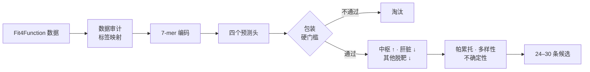

<div align="center">
  <h1>LIFS-Comp_AAV9</h1>
  <p><strong>面向脊髓性肌萎缩症的 AAV9 衣壳组织特异性计算设计</strong></p>
  <p>中枢富集代理 · 降低肝脏负担代理 · 包装约束虚拟筛选</p>
  <p>
    <a href="README.md">English</a>
    ·
    <a href="README.zh-CN.md"><strong>简体中文</strong></a>
    ·
    <a href="docs/PROJECT_SPEC.md">项目定义</a>
    ·
    <a href="docs/FIT4FUNCTION_AUDIT.md">Fit4Function 审计</a>
  </p>
  <p>
    
    
    
    
  </p>
</div>

<p align="center">
  
</p>

## 项目概览

`LIFS-Comp_AAV9` 是一个面向 LIFS Competition 的四人、四周计算研究项目。
我们计划在 AAV9 的目标表面位置进行受约束的 7-mer 插入设计，并回答一个明确问题：

> 能否在保留衣壳包装潜力的前提下，使现有小鼠器官数据所代表的分布代理更偏向脑和脊髓，同时减少肝脏及其他器官脱靶？

应用场景是未来的 **SMA（脊髓性肌萎缩症）SMN1 递送**。我们改造的是递送载体衣壳，不是 SMN1 治疗基因。

## 为什么选择这个方向？

现有全身 AAV9 治疗为 SMA 提供了真实应用背景。本项目进一步把问题缩小为：能否利用多器官数据，找到预测分布更加偏向中枢、同时减少肝脏负担代理的衣壳候选。

| 目标 | 在筛选中的作用 | 当前代理标签 |
| --- | --- | --- |
| `F_pack` | **硬门槛** | 包装/生产标签 |
| `F_CNS` | 正向奖励 | 小鼠脑与脊髓预测均值 |
| `F_liv` | 主要惩罚 | 小鼠肝脏预测 |
| `F_off` | 次要惩罚 | 小鼠心脏与肾脏预测均值 |
| `R_imm` | 只做注释 | 抗体足迹或免疫风险邻近度 |

人肝细胞预测作为辅助警告保留，不再设置一个较大权重重复计算肝脏信号。

## 筛选漏斗



模型分别预测不同终点。展示分在模型训练完成后计算，不直接写入训练 loss：

```text
S  = 0.45 × F_CNS − 0.35 × F_liv − 0.20 × F_off
SI = F_CNS / (F_liv + ε)
```

权重只是当前工作假设。项目会进行权重扰动测试，并同时保留三类帕累托候选：**偏中枢、偏低肝和折中型**。

## 技术路线

| 层级 | 第一版实现 | 后续比较 |
| --- | --- | --- |
| 数据 | pandas、标准字段、缺失标签审计 | 批次和重复实验映射 |
| 序列 | 7-mer one-hot 编码 | 理化性质或预训练蛋白表示 |
| 模型 | 各终点 Ridge、Random Forest | LightGBM 或共享 PyTorch 编码器 |
| 验证 | 序列感知切分、留出集指标 | 不确定性、猕猴盲测 |
| 筛选 | 包装门槛、S、SI、帕累托 | 多样性、训练距离和结构抽检 |

项目先建立简单、可解释的基线。只有在无数据泄漏的留出测试中确实改善，才引入神经网络。

## 仓库结构

```text
LIFS-Comp_AAV9/
├── configs/default.yaml        # 目标、权重和验证策略
├── data/                       # 本地数据目录，内容不提交 Git
├── docs/
│   ├── PROJECT_SPEC.md         # 科学问题和声明边界
│   ├── DATA_CONTRACT.md        # 标准标签与审计问题
│   └── TEAM_WORKFLOW.md        # 四人分工和 Git 协作方式
├── notebooks/                  # 只放探索性分析
├── src/aav9_sma/
│   ├── data/audit.py           # 数据覆盖和质量检查
│   ├── features/encode.py      # 可复现 7-mer 编码
│   ├── models/baseline.py      # Ridge/随机森林基线
│   └── screening/              # 包装门槛、评分和帕累托
├── tests/                      # 单元测试
└── pyproject.toml              # Python 依赖和工具配置
```

## 快速开始

```bash
git clone https://github.com/stephenovo/LIFS-Comp_AAV9.git
cd LIFS-Comp_AAV9

python3 -m venv .venv
source .venv/bin/activate
python -m pip install --upgrade pip
python -m pip install ".[dev]"

ruff check .
pytest
```

需要 LightGBM 或 PyTorch 时：

```bash
python -m pip install ".[dev,models]"
```

## 命令行骨架

将来源字段映射到标准字段后，运行数据审计：

```bash
aav9-sma audit-data data/processed/fit4function.csv \
  --output artifacts/data_audit.json
```

根据训练与验证证据确定包装阈值后，对模型预测结果排序：

```bash
aav9-sma rank-candidates artifacts/predictions.csv \
  --packaging-threshold 0.50 \
  --output artifacts/ranked_candidates.csv
```

这里的 `0.50` 只是命令示例，不是预先确定的生物学阈值。

## 当前进度

- [x] 研究问题和声明边界
- [x] Python 项目与持续集成
- [x] 标准数据字段
- [x] 数据审计、序列编码和基线模型骨架
- [x] 包装门槛、展示分和帕累托工具
- [x] Fit4Function 处理表、Zenodo 与 SRA 深度审计
- [x] 单条脊髓 FASTQ 的 21-nt / 7-mer 提取 pilot
- [x] 100K 带序列表的 Ridge / Random Forest sanity check
- [ ] 69-run 多器官原始数据重建
- [ ] 防数据泄漏的基线评估
- [ ] 多任务模型比较
- [ ] 候选生成和最终候选集

## 科学边界

本仓库提供的是**计算假设**，不是已经验证的疗法。

- 小鼠脑/脊髓富集是中枢代理，不等于已证明人运动神经元特异性；
- 预测肝脏富集下降，不等于已经证明肝毒性下降；
- 包装和组织分布预测仍需实验验证；
- 本项目不声称替代或优于 Zolgensma。

## 主要参考资料

- [Fit4Function：数据驱动的 AAV 衣壳工程](https://pmc.ncbi.nlm.nih.gov/articles/PMC11297966/)
- [AAV 基因治疗载体工程综述](https://www.nature.com/articles/s41576-019-0205-4)
- [FDA Zolgensma 处方资料](https://www.fda.gov/media/126109/download)

---

<div align="center">
  <strong>先保证能包装，再优化分布代理，让每一个结论都可以被验证。</strong>
</div>
