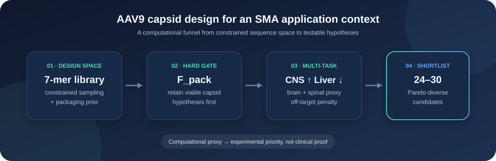
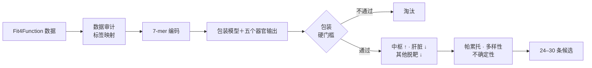
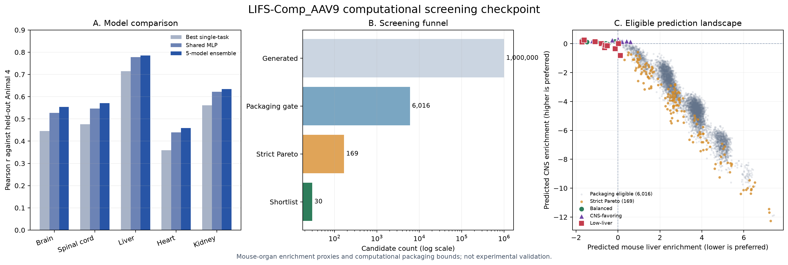

<div align="center">
  <h1>LIFS-Comp_AAV9</h1>
  <p><strong>面向脊髓性肌萎缩症的 AAV9 衣壳组织特异性计算设计</strong></p>
  <p>中枢富集代理 · 降低肝脏负担代理 · 包装约束虚拟筛选</p>
  <p>
    <a href="README.md">English</a>
    ·
    <a href="README.zh-CN.md"><strong>简体中文</strong></a>
    ·
    <a href="docs/PROJECT_SPEC.md">项目定义</a>
    ·
    <a href="docs/FIT4FUNCTION_AUDIT.md">Fit4Function 审计</a>
    ·
    <a href="docs/THREE_ROUTE_CONSENSUS.md">三路线共识与差异</a>
    ·
    <a href="docs/EXPERIMENTAL_VALIDATION_SOP.zh-CN.md">实验验证 SOP</a>
  </p>
  <p>
    
    
    
    
  </p>
</div>

<p align="center">
  
</p>

## 项目概览

`LIFS-Comp_AAV9` 是一个面向 LIFS Competition 的四人、四周计算研究项目。
我们计划在 AAV9 的目标表面位置进行受约束的 7-mer 插入设计，并回答一个明确问题：

> 能否在保留衣壳包装潜力的前提下，使现有小鼠器官数据所代表的分布代理更偏向脑和脊髓，同时减少肝脏及其他器官脱靶？

应用场景是未来的 **SMA（脊髓性肌萎缩症）SMN1 递送**。我们改造的是递送载体衣壳，不是 SMN1 治疗基因。

## 为什么选择这个方向？

现有全身 AAV9 治疗为 SMA 提供了真实应用背景。本项目进一步把问题缩小为：能否利用多器官数据，找到预测分布更加偏向中枢、同时减少肝脏负担代理的衣壳候选。

| 目标 | 在筛选中的作用 | 当前代理标签 |
| --- | --- | --- |
| `F_pack` | **硬门槛** | 包装/生产标签 |
| `F_CNS` | 正向奖励 | 小鼠脑与脊髓预测均值 |
| `F_liv` | 主要惩罚 | 小鼠肝脏预测 |
| `F_off` | 次要惩罚 | 小鼠心脏与肾脏预测均值 |
| `R_imm` | 只做注释 | 抗体足迹或免疫风险邻近度 |

人肝细胞预测作为辅助警告保留，不再设置一个较大权重重复计算肝脏信号。

## 筛选漏斗



模型分别预测不同终点。展示分在模型训练完成后计算，不直接写入训练 loss：

```text
S  = 0.45 × F_CNS − 0.35 × F_liv − 0.20 × F_off
log2(SI) = F_CNS − F_liv
SI       = 2^(F_CNS − F_liv)
```

权重只是当前工作假设。项目用 27 组权重组合检查排序稳定性。最终清单分为
**偏中枢、偏低肝和折中型**，同时单独保留严格帕累托标记，不强迫每一条都属于前沿。

## 技术路线

| 层级 | 第一版实现 | 后续比较 |
| --- | --- | --- |
| 数据 | pandas、标准字段、缺失标签审计 | 批次和重复实验映射 |
| 序列 | 7-mer one-hot 编码 | 理化性质或预训练蛋白表示 |
| 模型 | 各终点 Ridge、Random Forest | 共享 `64→32` MLP 集成 |
| 验证 | 距离-2 序列切分、Animal 4 留出 | 有数据时做猕猴盲测 |
| 筛选 | 校准包装下界、S、SI、帕累托 | 权重稳定性、训练距离和多样性 |

项目先建立简单、可解释的基线。只有在无数据泄漏的留出测试中确实改善，才引入神经网络。

## 仓库结构

```text
LIFS-Comp_AAV9/
├── configs/default.yaml        # 目标、权重和验证策略
├── data/                       # 本地数据目录，内容不提交 Git
├── docs/
│   ├── PROJECT_SPEC.md         # 科学问题和声明边界
│   ├── DATA_CONTRACT.md        # 标准标签与审计问题
│   └── TEAM_WORKFLOW.md        # 四人分工和 Git 协作方式
├── notebooks/                  # 只放探索性分析
├── src/aav9_sma/
│   ├── data/audit.py           # 数据覆盖和质量检查
│   ├── features/encode.py      # 可复现 7-mer 编码
│   ├── models/baseline.py      # Ridge/随机森林基线
│   └── screening/              # 包装门槛、评分和帕累托
├── tests/                      # 单元测试
└── pyproject.toml              # Python 依赖和工具配置
```

## 快速开始

```bash
git clone https://github.com/stephenovo/LIFS-Comp_AAV9.git
cd LIFS-Comp_AAV9

python3 -m venv .venv
source .venv/bin/activate
python -m pip install --upgrade pip
python -m pip install ".[dev]"
```

## 先运行自包含 smoke test

下面的命令不需要 Fit4Function checkout、SRA 下载、SRA Toolkit 或 GPU，
会用确定性的合成数据跑通审计、预测表、包装门槛和候选排序流程：

```bash
aav9-sma demo --output-dir artifacts/demo
```

这些输出只用于检查安装和接口，不能用于生物学结论。详见
[可复现性说明](docs/REPRODUCIBILITY.md)。

```bash
ruff check .
pytest
```

需要 LightGBM 或 PyTorch 时：

```bash
python -m pip install ".[dev,models]"
```

## 命令行骨架

将来源字段映射到标准字段后，运行数据审计：

```bash
aav9-sma audit-data data/processed/fit4function.csv \
  --output artifacts/data_audit.json
```

根据训练与验证证据确定包装阈值后，对模型预测结果排序：

```bash
aav9-sma rank-candidates artifacts/predictions.csv \
  --packaging-threshold 0.50 \
  --output artifacts/ranked_candidates.csv
```

这里的 `0.50` 只是命令示例，不是预先确定的生物学阈值。

完整的 100 万序列虚拟筛选依赖外部数据。需要先按
[FIT4FUNCTION_RUNBOOK.md](docs/FIT4FUNCTION_RUNBOOK.md) 获取 Fit4Function
checkout 并重建多器官 CSV：

```bash
aav9-sma screen-virtual \
  data/raw/fit4function_official/data/fit4function_library_screens.csv \
  data/processed/fit4function_multiorgan_reconstructed.csv.gz \
  --pool-size 1000000 --ensemble-size 5 \
  --output-ranked artifacts/virtual_screen_ranked.csv.gz \
  --output-pareto docs/audit_data/virtual_screen_pareto.csv \
  --output-shortlist docs/audit_data/virtual_screen_shortlist.csv \
  --output-summary docs/audit_data/virtual_screen_summary.json
```

## 当前进度

- [x] 研究问题和声明边界
- [x] Python 项目与持续集成
- [x] 标准数据字段
- [x] 数据审计、序列编码和基线模型骨架
- [x] 包装门槛、展示分和帕累托工具
- [x] Fit4Function 处理表、Zenodo 与 SRA 深度审计
- [x] 单条脊髓 FASTQ 的 21-nt / 7-mer 提取 pilot
- [x] 论文参数 Bowtie2 pilot、ENA 断点续传与 MD5 校验
- [x] 100K 带序列表的 Ridge / Random Forest sanity check
- [x] Liver + 病毒库重建通过公开标签验收（`r = 0.978`）
- [x] 60 个器官 runs + 3 个已验证 prod2 分母 runs 的序列标签重建
- [x] 序列距离隔离 + Animal 4 生物学留出测试
- [x] 共享多任务模型与五模型集成比较
- [x] PyTorch masked-loss 多任务模型与 LightGBM＋理化特征挑战者
- [x] 五类指标、500 次 bootstrap 95% 区间与模型晋级规则
- [x] 四组经验对照的漏斗方向性审计
- [x] 100 万序列虚拟筛选和 30 条计算候选
- [x] 严格保守候选子集与 NAb 位点背景注释
- [x] 中英文实验验证 SOP、预注册模板、候选面板和数据录入工作簿

### 多器官数据阶段结果

当前重建表把 100,000 条 7-mer 与脑、脊髓、肝、心、肾的逐动物富集标签连接起来。
63 个 runs 共处理 385,983,540 条比对记录，其中 96,169,266 条落入公开 100K
序列清单。严格基线只用 Animal 1–3 训练，从训练集中移除测试序列的一步突变邻居，
最终只在不参与训练的 Animal 4 上评价。Animal 4 已用于本轮模型比较，后续不再把它
称为从未查看的最终盲测。Animal 4 是 development held-out test，具体规则见
[`docs/ANIMAL4_POLICY.md`](docs/ANIMAL4_POLICY.md)。完整数据运行前可用
`aav9-sma verify-manifest` 检查 SHA256，并使用
[`scripts/reproduce_full.sh`](scripts/reproduce_full.sh) 执行不下载数据的审计、基准和筛选流程。

| 终点 | 四动物聚合有限标签 | Animal 1–3 vs Animal 4 `r` | Ridge vs Animal 4 `r` | 随机森林 vs Animal 4 `r` |
| --- | ---: | ---: | ---: | ---: |
| 脑 | 96,621 | 0.621 | 0.429 | **0.445** |
| 脊髓 | 97,397 | 0.640 | 0.446 | **0.476** |
| 肝 | 97,874 | 0.823 | 0.680 | **0.715** |
| 心 | 98,309 | 0.598 | 0.330 | **0.359** |
| 肾 | 98,332 | 0.730 | **0.561** | 0.539 |

机器可读结果见：[动物重复性](docs/audit_data/fit4function_multiorgan_replicate_metrics.csv)、
[逐 run QC](docs/audit_data/fit4function_multiorgan_run_qc.csv) 和
[严格基线](docs/audit_data/fit4function_multiorgan_baseline_metrics.csv)。

### 多任务与模型晋级结果

| 终点 | 最佳单任务 `r` | 五模型集成 `r` | masked PyTorch `r` | LightGBM＋理化 `r` |
| --- | ---: | ---: | ---: | ---: |
| 脑 | 0.445 | **0.554** | 0.547 | 0.522 |
| 脊髓 | 0.476 | **0.571** | 0.562 | 0.538 |
| 肝 | 0.715 | **0.785** | 0.781 | 0.774 |
| 心 | 0.359 | **0.458** | 0.453 | 0.408 |
| 肾 | 0.561 | **0.635** | 0.628 | 0.613 |

masked 模型利用了更多不完整标签行，但没有改善任何 Animal 4 终点；LightGBM 也未
超过现有集成。因此最终漏斗继续使用五模型集成。完整 95% bootstrap 区间和晋级理由见
[三路线共识报告](docs/THREE_ROUTE_CONSENSUS.md)。

### 虚拟筛选结果

正式筛选从 12.8 亿种理论 7-mer 空间中固定随机种子生成 1,000,000 条未见序列。
其中 6,016 条通过包装置信下界硬门槛，169 条位于严格帕累托前沿。最终 30 条分为
偏中枢、偏低肝和折中型各 10 条；全部与训练序列至少相差 2 位、候选之间至少相差
3 位，并处于过包装线序列综合分前 5%。其中 6 条属于严格帕累托前沿，其余 24 条
明确标记为兼顾得分与多样性的近前沿计算假设。新增的严格保守定义要求同时通过
包装下界、脑与脊髓各自的训练中位数、低肝训练中位数和低模型分歧；全池有 8 条，
最终清单包含其中 7 条。



机器可读结果见：[集成留出测试](docs/audit_data/fit4function_multitask_ensemble_metrics.csv)、
[169 条帕累托表](docs/audit_data/virtual_screen_pareto.csv)、
[30 条候选清单](docs/audit_data/virtual_screen_shortlist.csv) 和
[筛选摘要](docs/audit_data/virtual_screen_summary.json)。模型挑战者、晋级结论和对照漏斗
审计见 [三路线共识与差异](docs/THREE_ROUTE_CONSENSUS.md)。
本轮最终升级、问题处置与通俗故事线见
[最终升级报告](docs/FINAL_UPGRADE_REPORT.zh-CN.md)。
没有湿实验时的完成度、已自动修复项和待决策项见
[计算阶段最终审计](docs/COMPUTATIONAL_READINESS_REVIEW.zh-CN.md)。
下一批新数据的模型级与候选级盲测、四方分权、冻结命令和一次解盲规则见
[最终盲测方案](docs/FINAL_BLIND_TEST_PROTOCOL.zh-CN.md)。组成偏倚另用
[12 条包装/QC 挑战组](docs/audit_data/composition_challenge_panel.csv)检查，不改变原 30 条主名单。

### 实验验证交接包

当前计算候选已经接上预注册的实验决策路径。[中文 SOP](docs/EXPERIMENTAL_VALIDATION_SOP.zh-CN.md)
和[英文 SOP](docs/EXPERIMENTAL_VALIDATION_SOP.md)明确规定了同背景对照、盲法、独立生产批次、
包装质控、运动神经元与肝细胞实验、全身给药小鼠分布、SMA 后续验证、中和抗体实验、统计方法，
以及 go/hold/stop 规则。具体培养、转染、纯化和动物操作必须由具备资质的 AAV 平台在机构审批和
已验证 SOP 下执行。

交接材料包括：[37 项候选/对照面板](docs/audit_data/experimental_validation_panel.csv)、
[来源校验清单](docs/audit_data/experimental_validation_manifest.json)、
[长表型结果录入模板](docs/audit_data/wet_lab_results_template.csv)、
[阶段决策日志](docs/audit_data/wet_lab_decision_log.csv)、
[中英文预注册模板](docs/WET_LAB_PREREGISTRATION_TEMPLATE.md)，以及
[排版后的 Excel 工作簿](docs/audit_data/experimental_validation_handoff.xlsx)。
机器可读候选表、校验清单和空白模板可用下列命令重新生成：

```bash
PYTHONPATH=src python3 scripts/build_experimental_handoff.py \
  --shortlist docs/audit_data/virtual_screen_shortlist.csv \
  --controls docs/audit_data/funnel_control_audit.csv \
  --output-dir docs/audit_data
```

排版后的 Excel 是上述机器可读文件的同步阅读版；实验样本的唯一权威清单仍是 CSV 面板。

## 科学边界

本仓库提供的是**计算假设**，不是已经验证的疗法。

- 小鼠脑/脊髓富集是中枢代理，不等于已证明人运动神经元特异性；
- 预测肝脏富集下降，不等于已经证明肝毒性下降；
- 包装和组织分布预测仍需实验验证；
- 本项目不声称替代或优于 Zolgensma。

## 主要参考资料

- [Fit4Function：数据驱动的 AAV 衣壳工程](https://pmc.ncbi.nlm.nih.gov/articles/PMC11297966/)
- [AAV 基因治疗载体工程综述](https://www.nature.com/articles/s41576-019-0205-4)
- [FDA Zolgensma 处方资料](https://www.fda.gov/media/126109/download)

---

<div align="center">
  <strong>先保证能包装，再优化分布代理，让每一个结论都可以被验证。</strong>
</div>
